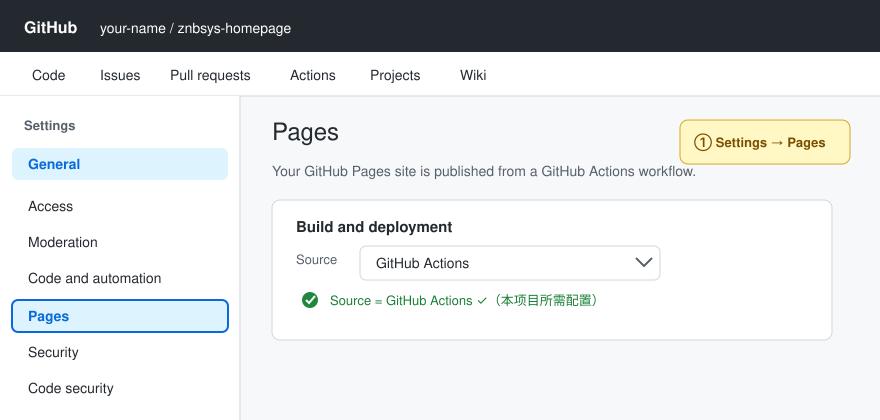
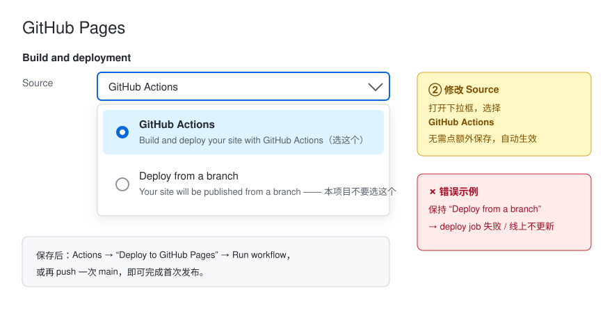
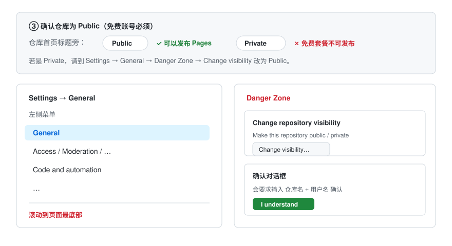
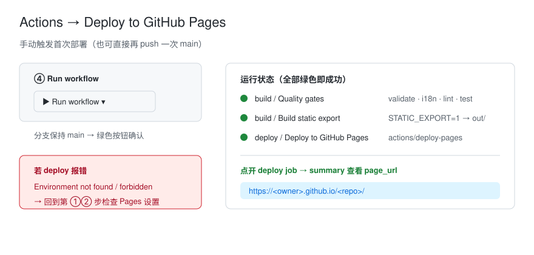

# GitHub Pages 部署手册

本手册说明如何将本项目（Next.js 14 多语言官网）**免费托管到 GitHub Pages**。全程无需自有服务器，push 到 `main` 即自动构建并上线。

> 自有服务器部署（SSH / Nginx）见 [`DEPLOY_GUIDE.md`](./DEPLOY_GUIDE.md) 与 [`README.zh-CN.md`「部署」](./README.zh-CN.md#部署)。两条通道相互独立，可同时启用。

---

## 一、前置条件

| 项 | 要求 |
| --- | --- |
| 仓库 | 已推送到 GitHub，默认分支为 `main` |
| Node.js | 本地预览时需 20+（CI 使用 Node 20） |
| 工作流文件 | `.github/workflows/pages.yml` 已存在于仓库中 |
| 账号 | 免费版 GitHub 账号即可（Public / Private 仓库均支持） |

无需配置任何 Secrets；basePath 与站点源由 CI 根据仓库名自动推导。

---

## 二、开启 Pages（一次性配置）

### 步骤 1：进入设置页

仓库顶部导航栏最右侧点击齿轮图标 **Settings**，左侧菜单找到 **Code and automation → Pages** 并点击。



### 步骤 2：将构建源改为 GitHub Actions

在 **Build and deployment → Source** 下拉框中选择 **GitHub Actions**（选择后自动保存，无需额外按钮）。



> ⚠️ 不要保持默认的 “Deploy from a branch”，否则本项目的 `deploy-pages` 步骤会失败。

### 步骤 3：免费账号确认仓库为 Public

GitHub **免费版（Free plan）只能从公共仓库发布 Pages**。回仓库首页看标题旁的可见性徽章：

- 显示 **Public** → 可以继续
- 显示 **Private** → 需先改为 Public（Settings → General → 拉到最底部 **Danger Zone → Change visibility**；或升级到 GitHub Pro 等付费套餐）



完成以上步骤后，每次 push 到 `main` 都会自动部署；也可在 **Actions** 页手动运行 **Deploy to GitHub Pages** 做首次发布。

### 步骤 4（可选）：手动触发首次部署

**Actions → Deploy to GitHub Pages → Run workflow**（分支选 `main`）。全绿后点开 `deploy` job 的 summary，其中 **page_url** 即为你的站点地址。



### 注意事项

- **必须手动开启一次**：GitHub 不会因为推送了 `pages.yml` 就自动启用 Pages。若 Source 仍是默认的 “Deploy from a branch”，工作流的 deploy 步骤会失败（报 `Environment not found` 或类似错误），必须进入仓库设置手动改。
- **Source 必须选 GitHub Actions**：本项目由 `actions/deploy-pages@v4` 发布，而不是从 `gh-pages` 分支或 `docs/` 目录拉取。选成 “Deploy from a branch” 会导致线上内容为空或永远不更新。
- **免费账号请将仓库设为 Public**：GitHub 免费版（Free plan）的 Pages 仅对 **公共仓库** 开放；Private 仓库发布 Pages 需要 GitHub Pro / Team 等付费套餐。若仓库是 Private 且套餐不支持，Pages 设置页会提示不可用，deploy job 也会失败——请先在 **Settings → General → Danger Zone → Change visibility** 将仓库改为 Public（或升级套餐）。
- **改完设置无需改代码**：Source 切换对仓库内容零影响，保存后手动 Run workflow 或再 push 一次即可完成首次发布。
- **fork 场景**：从他人仓库 fork 后，Pages 设置不会继承，需在自己的 fork 上重新执行上述开启步骤；同时 fork 仓库名若不同，basePath 会由 CI 自动按新仓库名推导，无需手改。
- **组织仓库权限**：若仓库属于 Organization，账号需对该仓库有 Pages 管理权限（通常需 Admin），否则 Settings 下看不到 Pages 选项。
- **免费额度（Soft limit）**：站点发布每月软限制约 100 GB 带宽、单站点 1 GB；超限会收到 GitHub 账单告警（一般个人站点远达不到）。构建使用 GitHub Actions 免费分钟数，Public 仓库不限量，Private 仓库计入免费额度。

---

## 三、部署流程

工作流文件：[`.github/workflows/pages.yml`](./.github/workflows/pages.yml)

```
push main（或 workflow_dispatch）
        │
        ▼
┌─ build job ────────────────────────────────────────────┐
│ 1. Checkout + Setup Node 20（npm 缓存）                 │
│ 2. npm ci                                              │
│ 3. 质量门禁：                                           │
│      validate → check:i18n → lint → typecheck → test   │
│ 4. 推导环境变量（见下节）                                │
│ 5. STATIC_EXPORT=1 npm run build  →  纯静态产物 out/    │
│ 6. actions/upload-pages-artifact@v3（path: out）        │
└────────────────────────────────────────────────────────┘
        │
        ▼
┌─ deploy job ───────────────────────────────────────────┐
│ actions/deploy-pages@v4                                │
│ environment: github-pages                              │
│ 输出 page_url（本次上线地址）                            │
└────────────────────────────────────────────────────────┘
```

- **并发控制**：`concurrency.group: github-pages`，新推送会取消进行中的旧部署
- **权限**：`contents: read` / `pages: write` / `id-token: write`（官方 Pages OIDC 部署要求）
- **门禁失败即中止**：lint / 类型 / 测试任一失败不会发布，线上保持上一版本

### 环境变量推导规则

| 变量 | 规则 | 示例（仓库 `znbsys-homepage`，owner `znb`） |
| --- | --- | --- |
| `NEXT_PUBLIC_SITE_URL` | `https://<owner>.github.io`（**只放协议+主机，不含路径**） | `https://znb.github.io` |
| `NEXT_PUBLIC_BASE_PATH` | 仓库名以 `.github.io` 结尾（用户站）→ 空；否则 → `/<repo>` | `/znbsys-homepage` |

路径前缀由 `basePath` 统一负责，`SITE_URL` 不重复拼路径；站内链接经 `lib/paths.ts` 的 `withBase()` 自动加前缀。

---

## 四、静态导出模式说明

CI 以 `STATIC_EXPORT=1` 构建时，`next.config.mjs` 切换为：

```js
{ output: 'export', trailingSlash: true, images: { unoptimized: true } }
```

| 行为 | 说明 |
| --- | --- |
| 产物目录 | `out/`（纯 HTML/CSS/JS，可被任意静态服务器托管） |
| 尾斜杠 | `trailingSlash: true`，路径统一为 `/zh-CN/` 形式，避免 Pages 目录 404 |
| 图片 | `images.unoptimized: true`，禁用 next/image 服务端优化（静态托管无 Node 运行时） |
| middleware | **不参与运行时**（Next 仅告警，构建不失败） |
| 根路径 `/` | 由 `app/page.tsx` 客户端完成：cookie `NEXT_LOCALE` → `navigator.language` → 跳转 `/zh-CN/`、`/en/` 或 `/ja/` |
| `/admin` | 正常工作（主题色 / 明暗切换存 `localStorage`，无服务端依赖） |

与服务器部署的唯一差异是根路径语言协商方式；页面内容、路由、SEO（hreflang / canonical 经 `withBase` 拼接）完全一致。

---

## 五、上线地址

| 仓库类型 | 站点地址 | basePath |
| --- | --- | --- |
| 项目站（如 `znb/znbsys-homepage`） | `https://znb.github.io/znbsys-homepage/` | `/znbsys-homepage` |
| 用户站（仓库名 = `<owner>.github.io`） | `https://znb.github.io/` | 空 |

访问 `/` 会自动跳转到浏览器语言匹配的首页；也可直接访问：

- `https://<owner>.github.io/<repo>/zh-CN/`
- `https://<owner>.github.io/<repo>/en/`
- `https://<owner>.github.io/<repo>/ja/`
- `https://<owner>.github.io/<repo>/admin`

---

## 六、本地预览导出结果

```bash
# 与 CI 相同的方式构建（示例 basePath 为本仓库名）
STATIC_EXPORT=1 NEXT_PUBLIC_BASE_PATH=/znbsys-homepage npm run build

# 产物在 out/，任意静态服务器均可预览
npx serve out          # 或：python3 -m http.server -d out 8080
```

预览检查清单：

- [ ] `/` 出现 “Redirecting…” 并跳到 `/zh-CN/`（或匹配语言）
- [ ] 三语言页、`/admin`、404 页均 200
- [ ] 页面源码中 canonical 形如 `https://<owner>.github.io/znbsys-homepage/zh-CN/`
- [ ] favicon、JS/CSS 请求路径带 `/znbsys-homepage` 前缀

> 本地不设 `NEXT_PUBLIC_BASE_PATH` 时按根路径构建，与线上项目站不一致；预览项目站务必带上变量。

---

## 七、常用操作

### 手动触发部署

**Actions → Deploy to GitHub Pages → Run workflow**（分支选 `main`）。

### 查看部署日志与线上地址

**Actions** 页点开最近一次运行 → `build` / `deploy` job 日志；`deploy` job 的 summary 会显示 `page_url`。

### 强制刷新 CDN 缓存

Pages 有边缘缓存。回滚或热修后若仍见旧页面：

1. 重新 Run workflow 一次；或
2. 浏览器强制刷新（`Cmd/Ctrl + Shift + R`）；或
3. 访问带查询串的地址验证，如 `/?v=2`

### 回滚

Pages 按分支部署，回滚即回滚代码：

```bash
git revert <commit>        # 或 git reset --hard <good-sha> 后强推（仅建议个人仓库）
git push origin main       # 自动触发重新部署
```

---

## 八、绑定自定义域名（可选）

1. **Settings → Pages → Custom domain** 填入域名（如 `www.example.com`）并 Save
2. 按 GitHub 提示在 DNS 服务商添加记录：
   - `www.example.com` → CNAME → `<owner>.github.io`
   - 或 apex 域名 → A 记录 → `185.199.108.153` / `109.234` / `110` / `111`（GitHub 官方 IP）
3. 勾选 **Enforce HTTPS**（证书由 GitHub 自动签发，通常几分钟生效）
4. **重新 Run workflow**，使 `NEXT_PUBLIC_SITE_URL` 与之匹配：

   目前 CI 固定推导为 `https://<owner>.github.io`。绑定自定义域名后，若需 canonical/SEO 使用新域名，请在 `pages.yml` 的 “Determine basePath and site origin” 步骤中改为：

   ```bash
   echo "NEXT_PUBLIC_SITE_URL=https://www.example.com" >> "$GITHUB_ENV"
   ```

   （`NEXT_PUBLIC_BASE_PATH` 规则不变。）

---

## 九、与自有服务器通道的关系

| | GitHub Pages | 自有服务器（`deploy.yml`） |
| --- | --- | --- |
| 工作流 | `pages.yml` | `deploy.yml` |
| 默认状态 | **始终启用**（选好 Source 即生效） | **默认关闭**，需 Variable `ENABLE_SERVER_DEPLOY=true` |
| 产物 | `out/` 静态导出 | `.next/standalone` + `server.js` |
| 需要的密钥 | 无 | `SERVER_HOST` / `SERVER_USER` / `SSH_PRIVATE_KEY` |
| 费用 | 免费 | 服务器费用自担 |

两者可并存：仅走 Pages 时**不要**设置 `ENABLE_SERVER_DEPLOY`；`deploy.yml` 的 build job 会整段跳过，不产生任何服务器动作。

---

## 十、常见问题排查

### 1. Actions 报 “Invalid workflow file”

`.github/workflows/pages.yml` YAML 语法错误或权限不足。检查：

- Settings → Actions → General → **Workflow permissions**：允许读写（或保持默认，Pages 使用 OIDC）
- Settings → Pages → Source 已选 **GitHub Actions**

### 2. 页面 404（部署成功但访问不到）

| 检查项 | 操作 |
| --- | --- |
| Pages 是否启用 | Settings → Pages 应显示 “Your site is live” |
| 路径是否带前缀 | 项目站必须访问 `/<repo>/`，直接开根域名 404 属正常 |
| 尾斜杠 | 直接访问 `/zh-CN`（无斜杠）可能 404，用 `/zh-CN/` |
| 首次部署延迟 | 推送后 1–2 分钟生效，可稍后再刷 |

### 3. CSS / JS / favicon 全部 404

构建时 `NEXT_PUBLIC_BASE_PATH` 未生效（资源路径缺前缀）或前缀与仓库名不符。确认：

- 使用的是 `pages.yml`（而非本地裸 `npm run build`）
- 仓库名与 CI 推导一致； fork / 改名后重新 Run workflow

### 4. 根路径一直显示 “Redirecting…” 不跳转

客户端 JS 未加载或被缓存。硬刷新；检查浏览器控制台是否有资源 404（回到第 3 条）。三语言直达链接（`/zh-CN/` 等）不受影响。

### 5. 质量门禁失败，线上未更新

Actions 日志中定位失败步骤，本地复现：

```bash
npm run validate -- 'config/locales/*.json' 'config/fixtures/*.json'
npm run check:i18n
npm run lint
npm run typecheck
npm run test
```

修复后重新 push 即可；线上仍为上一次成功部署的版本。

### 6. 构建报 middleware / 图片相关警告

- middleware 在 `output: 'export'` 下被 Next 忽略，**仅警告不影响产物**
- `images.unoptimized` 为静态托管预期配置，非错误

### 7. 改了仓库名 / 转移了 owner

basePath 与 SITE_URL 会随下次 push 自动重推导；手动 Run workflow 一次即可。旧地址将失效，请同步更新外部链接与自定义域名 CNAME。

---

## 十一、部署检查清单

- [ ] Settings → Pages → Source = **GitHub Actions**
- [ ] `.github/workflows/pages.yml` 已推送到 `main`
- [ ] push 后 Actions 中 **Deploy to GitHub Pages** 绿色通过
- [ ] deploy job summary 中 `page_url` 可打开
- [ ] `/` 能按语言跳转；`/zh-CN/` `/en/` `/ja/` `/admin` 均正常
- [ ] canonical / hreflang 指向 `https://<owner>.github.io/<repo>/…`
- [ ] 资源（JS/CSS/favicon）路径带正确 basePath 前缀
- [ ] 未误设 `ENABLE_SERVER_DEPLOY`（若只想走 Pages）
- [ ] （可选）自定义域名 + Enforce HTTPS + `NEXT_PUBLIC_SITE_URL` 已同步

---

## 相关文档

- [`README.zh-CN.md`](./README.zh-CN.md) — 项目说明与双通道部署概览
- [`DEPLOY_GUIDE.md`](./DEPLOY_GUIDE.md) — 自有服务器部署（Nginx / SSL / Docker）
- [`SPEC.md`](./SPEC.md) — 需求与验收用例
- [GitHub Pages 官方文档](https://docs.github.com/pages)
- [Actions: deploying with GitHub Pages](https://docs.github.com/pages/getting-started-with-github-pages/configuring-a-publishing-source-for-your-github-pages-site)
